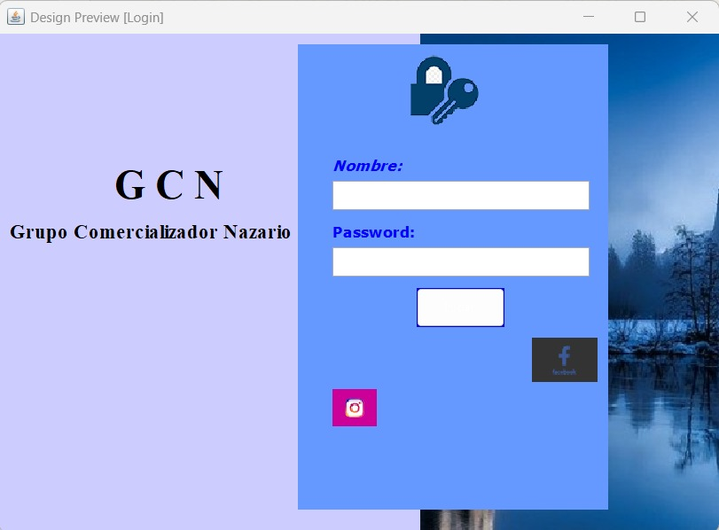
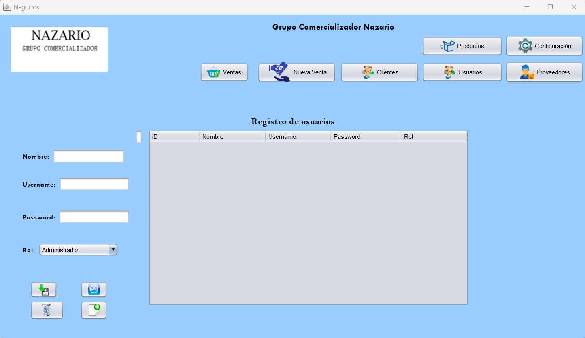
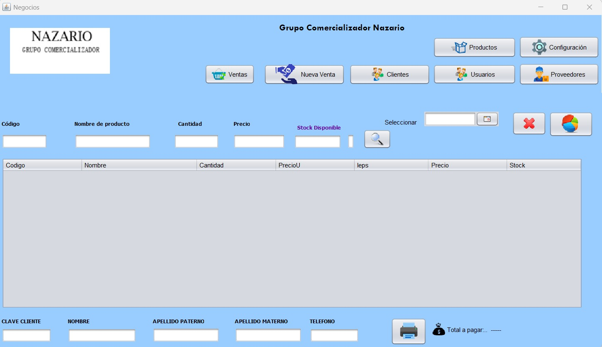
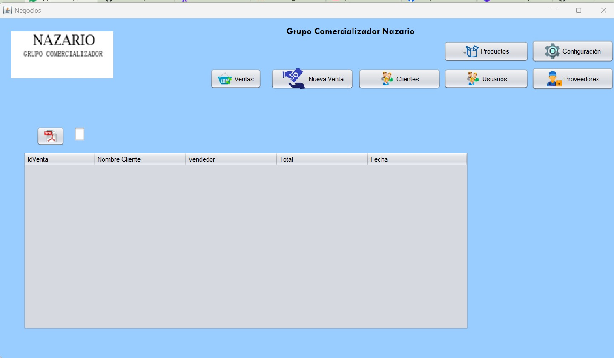
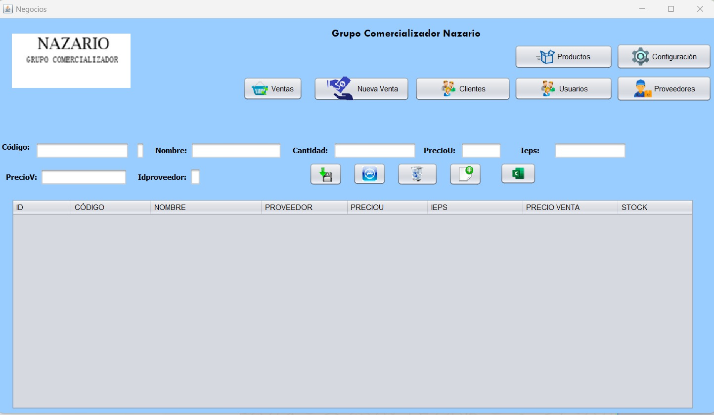
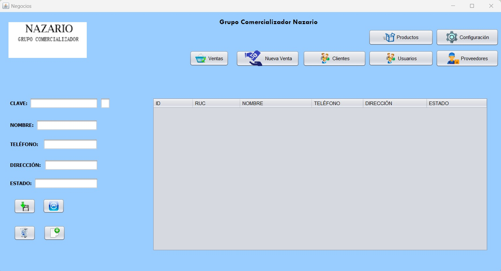
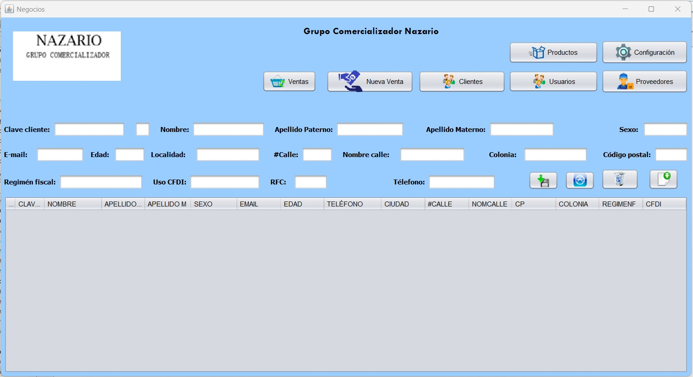
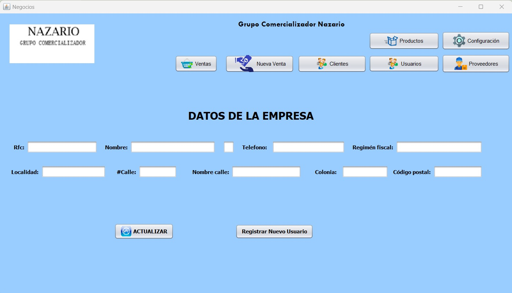

# POS-AleydaMorales
Sistema de venta desarrollado en java para Grupo comercializador Nazario, comercializadora de helados Holanda/Nestlé

# Descripción
este proyecto fue iniciado con el fin de una mejora para Grupo comercializador Nazario y pueda crecer y resaltar con su software en tiempos de operación.
# Avance
Se implementa la interfaz
- inicio de sesión
- control de inventario
- ventas
- Evidencia de tickets
- facturas
se esta implementando, en algunos solo es un avance
# Tecnologías utilizadas
se esta implementando en java, y en el servidor sql Maria db -> heidi sql para el almacenamiento de la base de datos.
# Instrucciones de installación
1. clonación del repositorio '''bash
2. git clone https://github.com/AleDM0/POS-AleydaMorales.git
3. acceder al directorio
4. instalar dependencias
5. ejecutar el sistema
## capturas de pantalla
pantalla de login:

modulo usuarios

modulo nueva venta

modulo venta/tickets

Modulo productos

Modulo proveedor

modulo cliente

modulo config

# Autor
Yessica De Los Santos Espinobarros & Aleyda Morales Diaz
